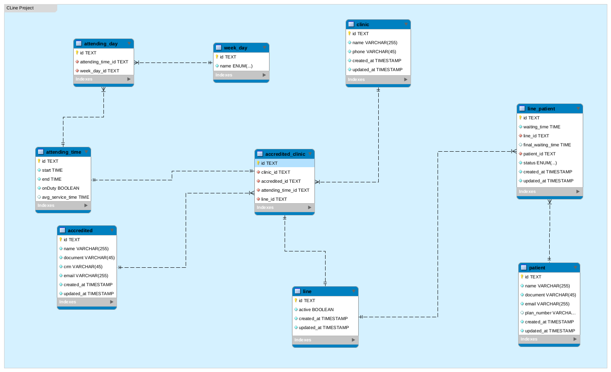

# ERD - Visão de Módulos/Data

- **ASSUNTO:** Demonstração do diagrama de relacionamento das entidades **(Database Model)**
- **DATA:** 02/05/2021

## Justificativa

---

Como CLine é uma aplicação que possui uma certa complexidade em relação ao seus dados, tipos de objetos e sua forma de armazenamento, utilizamos uma visão baseada no diagrama de entidades **(ERD)** de forma a deixar claro para a equipe como os modelos da aplicação irão se relacionar, facilitando assim a etapa de modelagem do banco de dados e implementação da API com um ORM.
