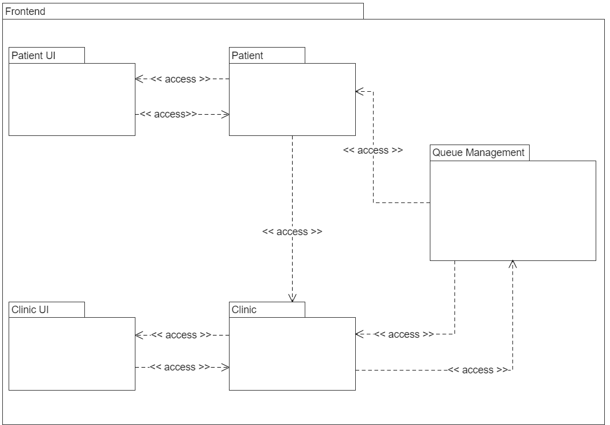

# UML - Visão de Módulos/Uso

- **ASSUNTO:** Demonstração do diagrama de relacionamento dos modulos baseado no acesso entre eles.
- **DATA:** 02/05/2021

## Justificativa

---

Utilizamos da visão de módulos/uso devido a necessidade de entendimento em relação a dependência dos módulos e como eles se relacionam entre si, facilitando assim a implementação com uma redução de erros e da necessidade de um tamanho muito grande de refatorações futuras.
